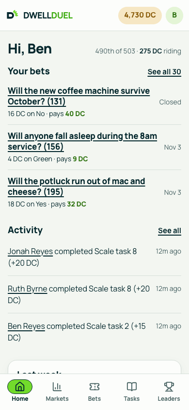
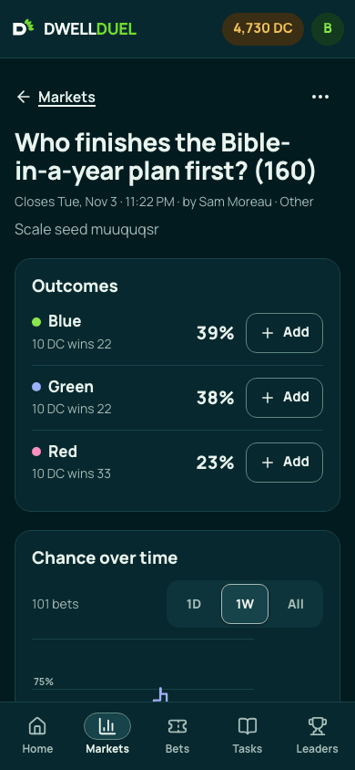
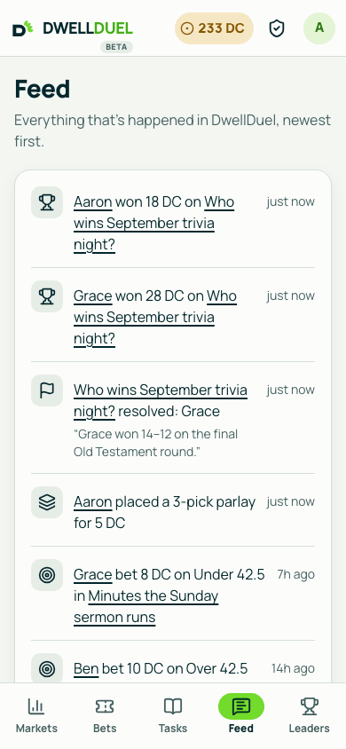
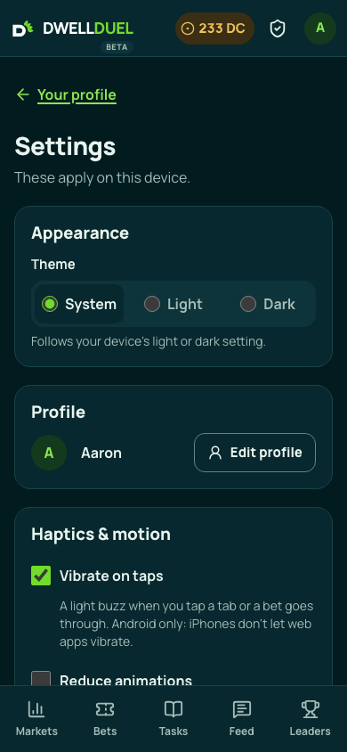
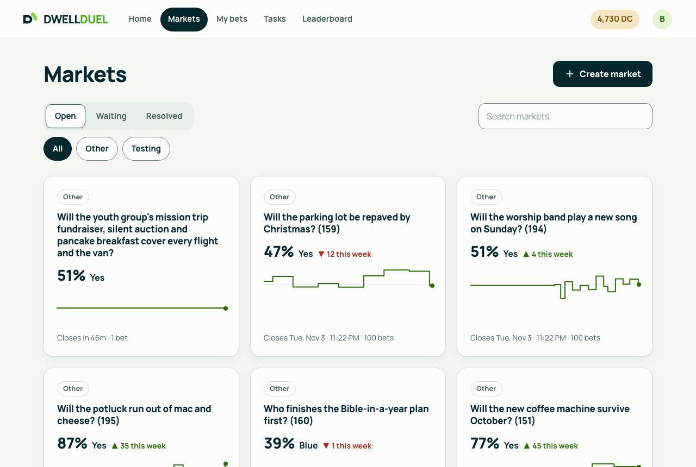

<p align="center">
  
</p>

<h1 align="center">DwellDuel</h1>

<p align="center">
  <strong>Friendly bets. Faithful study.</strong><br>
  An invite-only prediction-market app for a church friend group.<br>
  <a href="https://www.dwellduel.com">www.dwellduel.com</a> · <a href="CHANGELOG.md">Changelog</a> · <a href="docs/HOW-IT-WORKS.md">How it works</a> · <a href="docs/ARCHITECTURE.md">Architecture</a>
</p>

---

Members bet **Dwell Coin (DC)**, a play-money currency, on friendly
questions like "Will the sermon run past noon?" or "Who wins Sunday's
chili cook-off?". They earn more DC by completing Bible-study tasks.
Markets use shared-pool (pari-mutuel) odds; bets can be combined into
parlays; and everything that happens shows up in a live feed.

**Current release:** [v0.5.0-beta](https://github.com/Aaron-Wickham/dwell-duel/releases/tag/v0.5.0-beta) · see the [changelog](CHANGELOG.md).

| Home | A market | The feed | Settings |
|---|---|---|---|
|  |  |  |  |



## Features

**Betting**
- **Markets:** Yes/No, multiple choice (up to 6 outcomes) or Over/Under
  with a .5 line. Each has a live chance chart, a closing time and an edit
  history.
- **Seeded shared-pool odds:** every outcome starts with 20 DC, so a new
  market has odds from the start, and the percentages always match what
  gets paid.
- **One slip for every bet:** add outcomes from any market, mark each
  Solo or Parlay, and place them all at once.
- **Parlays:** 2–10 legs, odds locked at placement, capped at 100×.
- **Results with receipts:** resolving needs a reason and can carry
  photos, files or links. Admins can override (blocked if a past winner has
  already spent their winnings) or void (everyone is refunded).
- **My bets:** solo bets and parlays together, under Open, Settled and
  Cancelled. Bets can be cancelled until the market closes.

**Coins, tasks and people**
- **A ledger:** every DC movement is recorded, starting with a 100 DC
  welcome grant.
- **Bible-study tasks:** one-off or repeating (daily to yearly), with
  optional or required proof, and reviewed singly or in bulk.
- **Roles:** Owner › Admin › Reviewer › Member.
- **Social:** a leaderboard, member profiles with photos and bios, who bet
  what on each market, and a live activity feed.

**App feel**
- **Installable:** add it to your Home Screen for a full-screen app with a
  branded launch animation, safe areas, swipe back and page transitions.
- **Always responsive:** skeletons on every page, live updates without
  reloading, and an offline page.
- **Your settings:** light, dark or system theme, vibration on taps
  (Android) and reduced motion.

The member-facing rules, with worked payout examples, are in
[docs/HOW-IT-WORKS.md](docs/HOW-IT-WORKS.md).

## Stack

Next.js 16 (App Router, React 19) · TypeScript · Tailwind v4 · Supabase
(Postgres, Auth, Realtime, Storage) · Vercel · Vitest · Playwright.

All coin-moving logic lives in Postgres as permission-checked functions;
the web app renders, validates and calls them. See
[docs/ARCHITECTURE.md](docs/ARCHITECTURE.md) for the routes, the data
model, the key flows and the migrations.

## Documentation

| Doc | For |
|---|---|
| [docs/GETTING-STARTED.md](docs/GETTING-STARTED.md) | New here? Tools, local Supabase, sign-in, tests and your first PR, in order |
| [docs/HOW-IT-WORKS.md](docs/HOW-IT-WORKS.md) | The rules: odds, payouts, parlays, results, tasks, roles |
| [docs/ARCHITECTURE.md](docs/ARCHITECTURE.md) | How the code fits together |
| [AGENTS.md](AGENTS.md) | Conventions every change follows (read this before contributing) |
| [CHANGELOG.md](CHANGELOG.md) | What shipped in each release |
| [docs/design/app-redesign-handoff.md](docs/design/app-redesign-handoff.md) | The visual source of truth and the design canvas |
| [docs/README.md](docs/README.md) | An index of every doc, including the dated specs and plans |
| [CONTRIBUTING.md](CONTRIBUTING.md) | How changes get in: branches, pull requests and required review |
| [SECURITY.md](SECURITY.md) | How to report a vulnerability privately |

## Development

Requires Node 22 and Docker (for local Supabase).

```bash
npm install       # install dependencies
npm run db:start  # start local Supabase (Postgres, Auth, Storage) in Docker
npm run db:reset  # apply every migration to a fresh local database
npm run dev       # start the dev server on http://localhost:3000
```

Copy `.env.local.example` to `.env.local` and fill in
`NEXT_PUBLIC_SUPABASE_URL`, `NEXT_PUBLIC_SUPABASE_PUBLISHABLE_KEY` and
`SUPABASE_SECRET_KEY` from `npx supabase status` (its `API_URL`,
`PUBLISHABLE_KEY` and `SECRET_KEY`). Required variables are checked when
the server boots (`lib/env/required.ts`).

### Tests

```bash
npm test          # Vitest: unit, component and DB tests (DB tests need local Supabase)
npm run test:e2e  # Playwright: builds and serves the app on :3000, so free that port first
npm run lint      # ESLint, with no warnings allowed
npm run typecheck # TypeScript
npm run build     # production build
npm run check:ios # the installed iPhone app's viewport, in the iOS Simulator (scripts/ios-standalone-check.mjs)
```

`npx vitest run --project unit` runs only the tests that don't need the
database. After a migration, regenerate the database types with
`npx supabase gen types typescript --local > lib/supabase/database.types.ts`;
CI fails if they're stale.

Run `npm run db:reset` before tests that hit the database. The DB tests
refuse to run against anything but `localhost`, so they can never touch
production.

### Brand assets

`node scripts/generate-favicons.mjs` rebuilds the favicons, and
`node scripts/generate-splash.mjs` rebuilds the iOS launch screens. Both
use the symbol's art from `components/brand/symbol-paths.ts`.

## Production

- **Vercel project** `dwell-duel`, connected to this repo. Every merge to
  `main` deploys, but through `.github/workflows/deploy-production.yml`
  and a Vercel deploy hook (the `VERCEL_DEPLOY_HOOK_URL` repo secret), not
  Vercel's Git integration, which `vercel.json` turns off for `main`. Functions run in `cle1` (`vercel.json`), next to the
  Supabase project in us-east-2. A daily Vercel cron calls `/api/cron/keep-alive` so the
  free-tier Supabase project never pauses (it needs `CRON_SECRET`).
- **Supabase project** `dwell-duel` holds the real data. When a merge to
  `main` changes `supabase/migrations/`, the same workflow shows a dry run,
  pushes the migrations to production (it needs the
  `SUPABASE_ACCESS_TOKEN` repo secret) and only then triggers the app
  deploy, so new code never runs against an old schema. It never runs two
  at once. If a push fails, nothing deploys; fix it and re-run the
  workflow from the Actions tab.
- **Supabase keys.** Sessions are signed with an ECC (ES256) key, so the
  app verifies them locally with no Auth round trip; the legacy HS256
  secret is revoked and the legacy `anon` / `service_role` JWT API keys are
  disabled. Vercel holds the publishable key
  (`NEXT_PUBLIC_SUPABASE_PUBLISHABLE_KEY`) and, in Production only, the
  secret key (`SUPABASE_SECRET_KEY`). To rotate the secret key: create a
  new one under Supabase → Settings → API Keys, update the Vercel variable,
  redeploy, run the keep-alive cron from Vercel → Settings → Cron Jobs to
  check it, then delete the old key.
- **Push notifications** need a VAPID key pair in Vercel's Production
  environment: `NEXT_PUBLIC_VAPID_PUBLIC_KEY` and `VAPID_PRIVATE_KEY`
  (the subject is fixed as `https://www.dwellduel.com`). Generate them once
  with `npx web-push generate-vapid-keys`, and keep them: changing the pair
  stops every existing subscription from receiving, until each member
  turns notifications on again. Production won't boot without them
  (`lib/env/required.ts`); locally and in CI, sending is a no-op without
  them. The public key is inlined at build time, so redeploy after
  setting it.
- **Inviting someone** is purely in the app: add their email under Admin →
  Invites. Google's OAuth consent screen is published, so there's no
  Google Cloud step.
- **Gotcha:** `dwellduel.com` 308-redirects to `www.dwellduel.com`, so the
  app serves from `www`. Supabase's Site URL and Redirect URLs must use
  `www.dwellduel.com`. A mismatch makes Google sign-in silently bounce back
  to `/sign-in`.
- **No staging, and Vercel previews are off on purpose.** There's one
  hosted Supabase project (production), and the free tier's two-project
  limit is already used. Vercel's Preview environment has no credentials
  and the dashboard's Ignored Build Step setting skips every non-production
  build, so previews are off and PRs are reviewed through the diff and CI.
  Local Docker Supabase is the dev and test environment.

### One-time setup (outside the code)

- A Google Cloud OAuth client (web application) with the Supabase
  callback (`https://<project-ref>.supabase.co/auth/v1/callback`) as an
  authorized redirect URI, and its ID and secret entered under Supabase →
  Auth → Providers → Google.
- **Required:** in Supabase → Auth → Providers, disable every provider
  except Google, and disable email sign-ups. Otherwise anyone could get a
  session from the public publishable key without going through the invite gate.
- Add the app's redirect URLs (`http://localhost:3000/callback`, and the
  production one) to Supabase → Auth → URL Configuration.
- **Closing alerts' timer** (0064): in the SQL editor, store the app's origin
  and the same `CRON_SECRET` Vercel has, in Supabase Vault, so `pg_cron` can call
  `/api/cron/closing-alerts` within a minute of a market closing:
  `select vault.create_secret('https://www.dwellduel.com', 'app_url');` and
  `select vault.create_secret('<CRON_SECRET>', 'cron_secret');`. The backup
  GitHub workflow (`.github/workflows/closing-alerts.yml`) needs the
  `CRON_SECRET` repository secret and the `APP_URL` repository variable.
- **CI's Docker Hub login:** GitHub's runners share Docker Hub's anonymous
  pull limit, and `supabase start` pulls seven images per job. Create a
  free Docker Hub account, make a read-only access token (Account settings
  → Personal access tokens, permissions: Public repo read-only), and add
  it under Settings → Secrets and variables → Actions as the
  `DOCKERHUB_TOKEN` secret, with the account name as the
  `DOCKERHUB_USERNAME` variable. Until then CI pulls anonymously, and a
  fork's PR always does.
- **Hearing about failed deploys and pings:** under GitHub → Settings →
  Notifications → Actions, turn on "Send notifications for failed workflows
  only", so a failed migration, deploy, or closing-alerts backup ping is an
  email. For a failed Vercel build to count too, add a `VERCEL_TOKEN`
  repository secret (Vercel → Account settings → Tokens; it only needs to
  read deployments), which lets Deploy Production watch the build to READY;
  if the project belongs to a Vercel team, also set the team's id as the
  `VERCEL_TEAM_ID` variable. Keep Vercel's own failed-build email on as well.
- **Before your first sign-in,** invite yourself in the SQL editor:
  `insert into public.allowed_emails (email) values ('you@gmail.com');`
- **After it,** make yourself the owner, keyed off the verified
  `auth.users` row:
  `update public.profiles set role = 'owner' where id = (select id from auth.users where email = 'you@gmail.com');`
  From then on, grant Admin and Reviewer from Admin → Members. There is
  only ever one owner.

## CI

Every pull request runs lint, the type check, a check that the generated
database types match the migrations, the Vitest suite, a production build
and the Playwright suite (`.github/workflows/ci.yml`) as three parallel
jobs behind one required check, `ci-ok`, against a throwaway local
Supabase, never the production database. A PR must be up to date with
`main` to merge, so `main` itself isn't tested again: merging deploys.
Dependabot opens weekly update PRs for npm packages and GitHub Actions
(`.github/dependabot.yml`).

## Releases

| Release | Date | Highlights |
|---|---|---|
| [v0.5.0-beta](https://github.com/Aaron-Wickham/dwell-duel/releases/tag/v0.5.0-beta) | 2026-09-30 | The codebase review round: security fixes, slip and results bug fixes, loading that no longer jumps, faster live refresh, safer deploys, CI in half the time |
| [v0.4.0-beta](https://github.com/Aaron-Wickham/dwell-duel/releases/tag/v0.4.0-beta) | 2026-09-29 | Full-width desktop layouts, one motion language, review alerts, a markets filter, parlay breakdowns, a livelier leaderboard, deploys that wait for their migrations |
| [v0.3.0-beta](https://github.com/Aaron-Wickham/dwell-duel/releases/tag/v0.3.0-beta) | 2026-09-28 | Security fixes, retry-safe betting, a net-worth leaderboard with monthly champions, coin history, reactions and comments, streaks, profile stats, a weekly recap, push notifications, faster pages |
| [v0.2.0-beta](https://github.com/Aaron-Wickham/dwell-duel/releases/tag/v0.2.0-beta) | 2026-09-28 | Roles, seeded odds, 10-leg parlays, proof, Over/Under, market edits, My bets, Settings, a new Home, the launch animation |
| [v0.1.0-beta](https://github.com/Aaron-Wickham/dwell-duel/releases/tag/v0.1.0-beta) | 2026-09-27 | The first beta: markets, parlays, tasks, the coin ledger, the social layer, the installable app |

Full notes are in [CHANGELOG.md](CHANGELOG.md).
